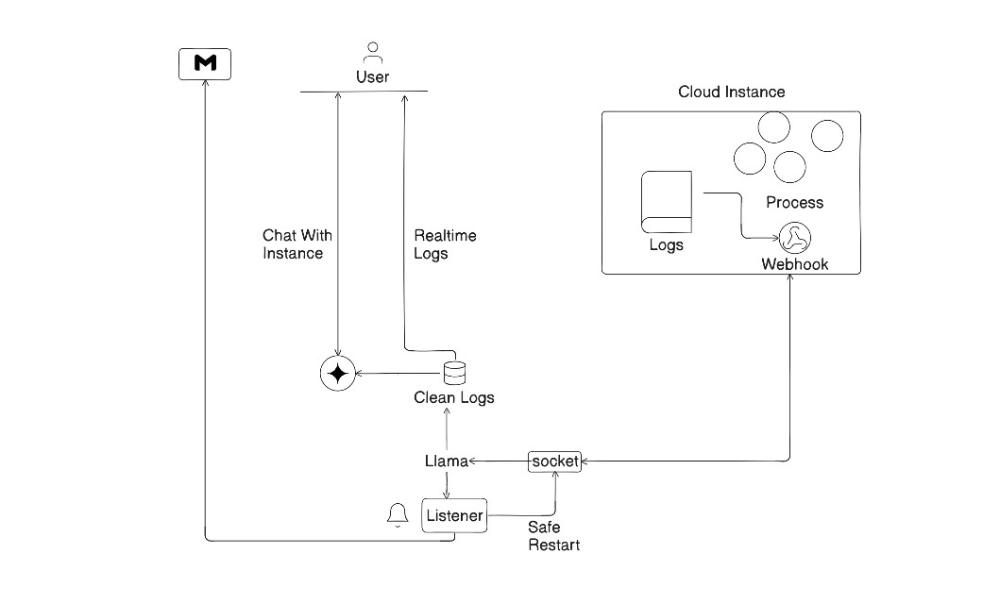

# 🚀 Skyward: The Autonomous Cloud SRE

> **We Don't Send Alerts. We Send Fixes.**

**🌐 Live Demo:** [https://skyward-inky.vercel.app/](https://skyward-inky.vercel.app/)

Skyward is a Multi-Agent System (MAS) that eliminates 3 AM manual debugging through real-time AI log intelligence and autonomous remediation. We are moving the industry from passive observability to active autonomy.

---

## ⚠️ The Problem: The 3 AM Crisis

Modern cloud scale has outpaced human capability.
* **The 3 AM Bottleneck:** Humans are too slow. MTTR is measured in hours while downtime costs $5,600/minute.
* **Log Fatigue:** Engineers spend 4.2 hours per incident parsing "ugly," cryptic raw logs across fragmented services.
* **Delayed Detection:** 73% of downtime goes undetected for over 10 minutes.

Traditional tools like Datadog and Splunk only provide data and trigger alerts. They rely on a paradigm of "Here is the data. Good luck finding the bug." We provide solutions.

---

## ✨ Product Features & Workflow

Our continuous, closed-loop system operates in four distinct phases:

1. **Ingest (Zero Latency):** Raw logs stream continuously from the edge instance via our lightweight Node.js manager.
2. **Transform (Llama 3.3):** "Ugly" terminal logs are instantly parsed into clean, prioritized insights via Llama-3. Llama acts as our "Fast Brain," processing logs in under 200ms.
3. **Diagnose (Gemini 2.0 Flash):** Our reasoning agent analyzes the log context to identify vulnerabilities and pinpoint the root cause.
4. **Remediate (User Guardrails):** Skyward instantly executes your trusted Auto-Fix command (e.g., `pm2 restart`). The user receives an email with the fix details and can chat with the Gemini Agent for deeper architecture insights.

---

## 🧠 Architecture & Workflow

Rather than just pulling data out, Skyward safely pushes commands back to the edge via an event-driven, bidirectional WebSocket tunnel.

---

## 🛠️ Technical Stack & Competitive Edge

| Component | Technology | Advantage |
| :--- | :--- | :--- |
| **Log Processing** | Groq (Llama 3.3) | 10x faster than traditional LLM APIs. |
| **Intelligence** | Gemini 2.0 Flash | Superior context handling and reasoning. |
| **Backend** | Node.js / Express | Event-driven, sub-100ms WebSocket latency. |
| **Competition** | vs. Datadog/Splunk | We provide solutions, they provide data. |

---

## 👥 Team: Decentralised Containers

* **Saish Mungase:** Focus: Agent Orchestration (LangGraph), Docker Infrastructure, & Backend Logic.
* **Aditya Tandale:** Focus: Agent System Design, LLM Prompt Optimization, & UI/UX Strategy.